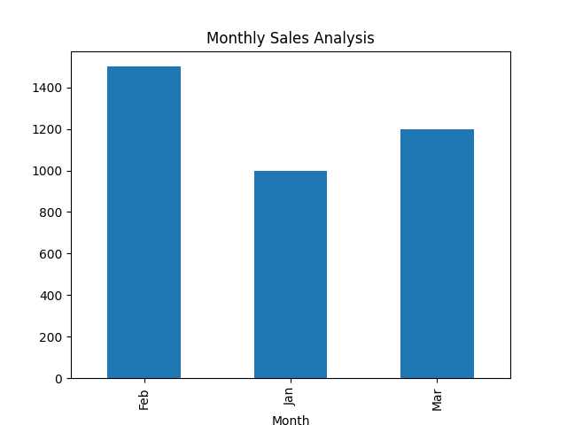

# Python_Learning_s
Pythonの実戦勉強を開始します

# Python-Portfolio
## 概要
Pythonで売上データを分析するツール。PandasでCSVを処理し、Matplotlibでグラフ化。
## 使い方
1. `data.csv`にデータを入力（例：Month,Sales）。
2. `app.py`を実行。
3. グラフは`output.png`に保存。
## 結果

## 使用技術
- Python, Pandas, Matplotlib
## 今後の予定
- WebスクレイピングやDXダッシュボードを追加！
- 

## プロジェクト2: Webスクレイピング
- **説明**: Books to Scrapeから本のタイトルと価格を抽出。RequestsとBeautifulSoupを使用。
- **ファイル**: `scraper.py`
- **使い方**: `scraper.py`を実行で本のリスト表示。
- **使用技術**: Python, Requests, BeautifulSoup

## プロジェクト3: Flaskで挨拶アプリ（Colab対応）

- **説明**: ユーザーが名前を入力すると、Web上で「こんにちは、〇〇さん！」と挨拶を返すアプリ。Google Colab上でFlaskを起動し、ngrokで外部公開。
- **ファイル**: `2025_0830_flask.py`
- **使い方**:
  1. Colabで `2025_0830_flask.py` を実行
  2. 出力された ngrok のURLにアクセス
  3. 名前を入力して送信すると、挨拶が表示される
- **使用技術**: Python, Flask, pyngrok
- **備考**: ngrokの認証トークンが必要
